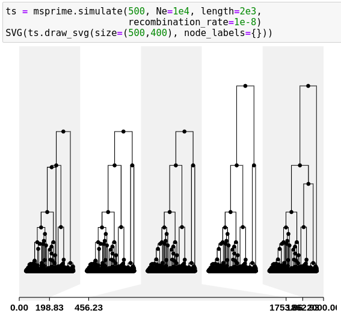
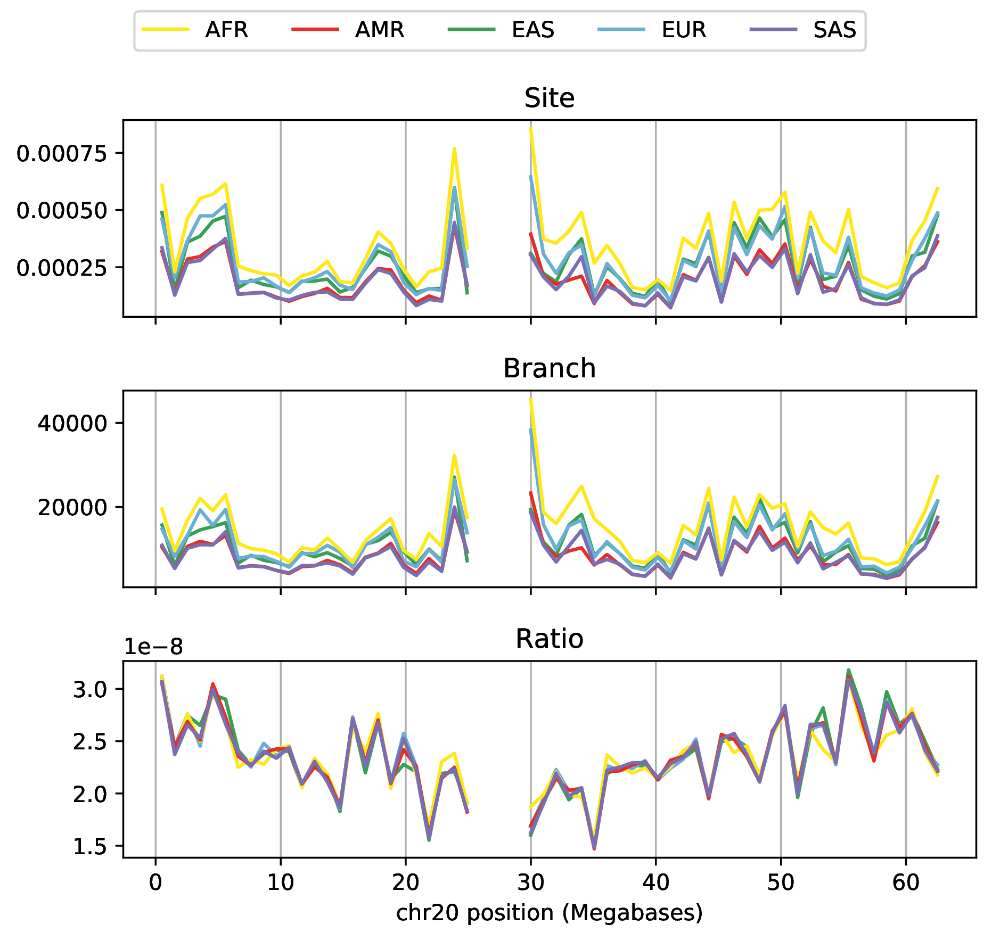
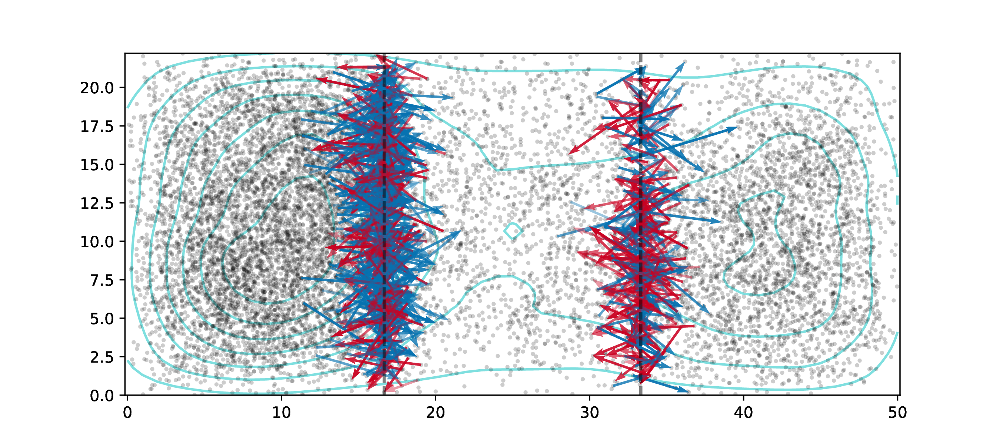
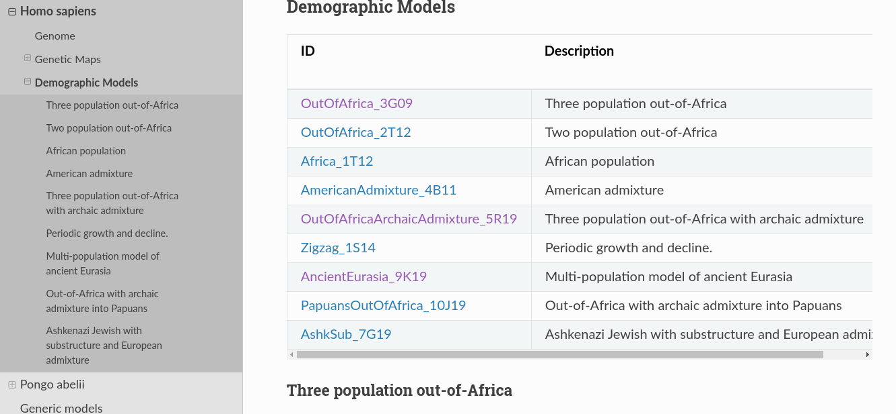
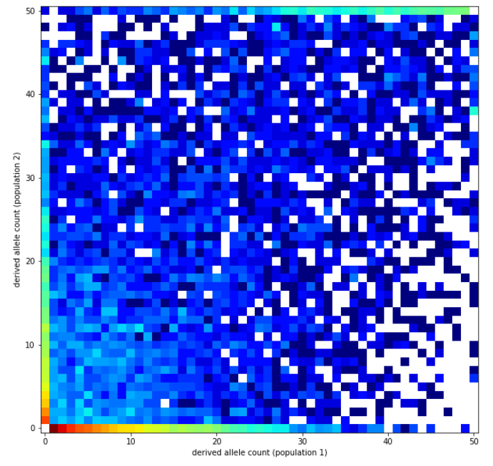
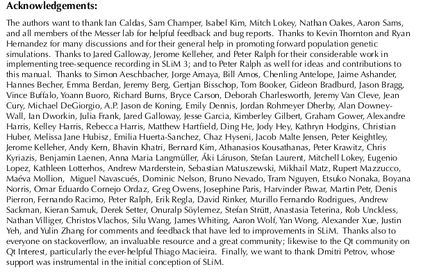
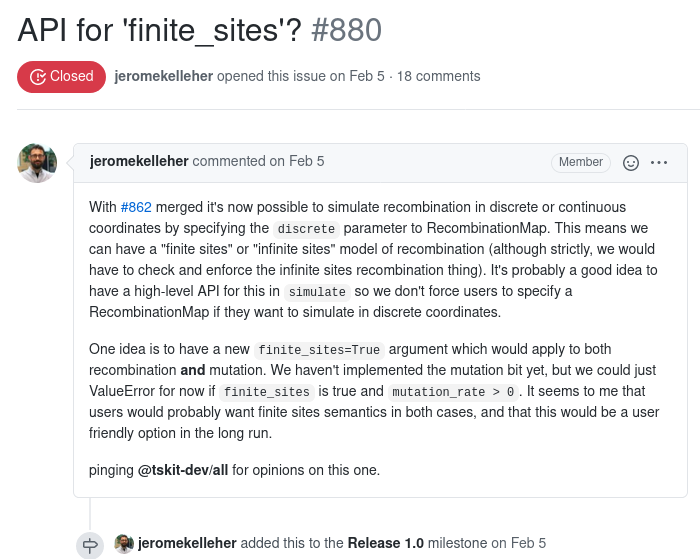
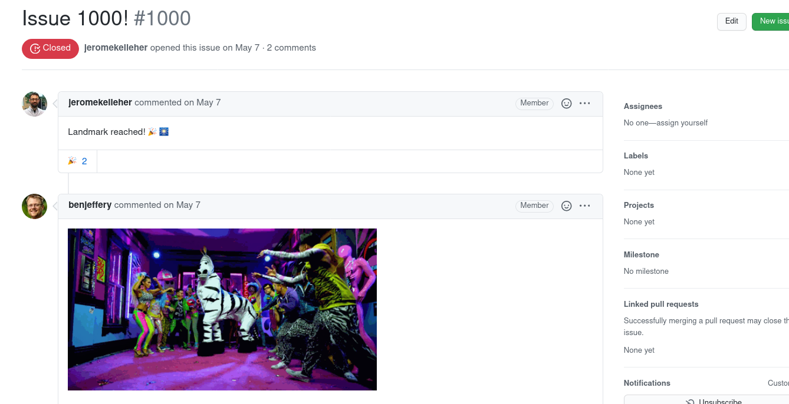
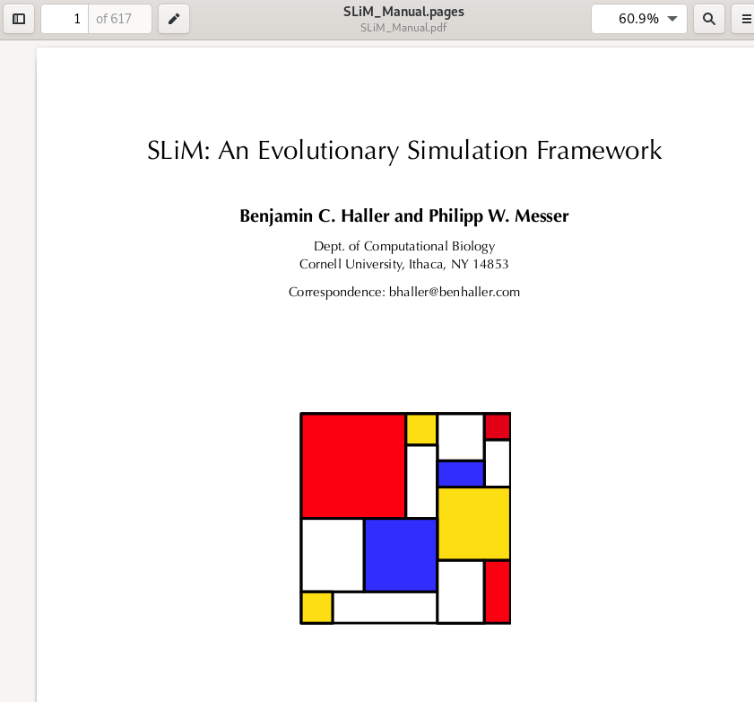
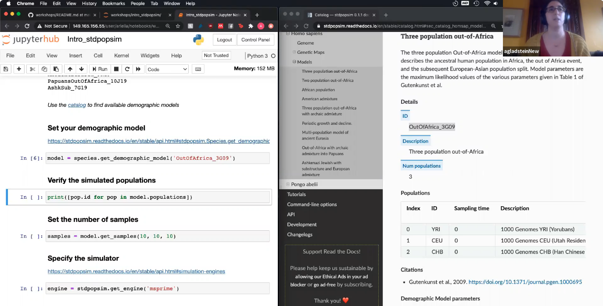

# Goals


## Simulation can help to:

> - make things concrete
> - look for unexpected things
> - guide and test ideas
> - assess sensitivity to assumptions

. . .

and to

> - validate and benchmark methods
> - fit models


## Goals of scientific software development

- lower barriers to good research
- be usable and accessible
- produce reproducible and reliable results

. . .

and so software development should

- give a voice to stakeholders
- emphasize usability and documentation
- produce tested, reproducible, and interoperable results
- be visualizable and debuggable

##

In science we stand on each others' shoulders

. . .

::: {.floatright}
and so we should be mindful about \
*how* and *where* we stand.
:::


# What can we simulate, today?

## Wish list:

::: {.smallish}

::: {.columns}
::::::: {.column}

Whole genomes,
thousands of samples, \
from millions of individuals.

**Demography:**

- life history 
- separate sexes
- selfing
- polyploidy
- species interactions

**Geography:**

- discrete populations
- continuous landscapes
- barriers

**History:**

- ancient samples
- range shifts

:::
::::::: {.column}

**Natural selection:**

- selective sweeps
- introgressing alleles
- background selection
- quantitative traits
- incompatibilities
- local adaptation

**Genomes:**

- recombination rate variation
- gene conversion
- infinite-sites mutation
- nucleotide models
- context-dependence
- mobile elements
- inversions
- copy number variation

:::
:::::::

:::

## msprime

::: {.columns}
::::::: {.column width=50%}


- a coalescent simulator, so
- discrete populations
- neutral* evolution
- fast

*coming soon:*

- selective sweeps (as in discoal)
- non-constant finite-sites mutation and recombination
- gene conversion
- multiple merger coalescents
- discrete time Wright-Fisher 

:::
::::::: {.column width=50%}



:::: {.caption}
see [github.com/tskit-dev/msprime](https://github.com/tskit-dev/msprime)
and [Kelleher, Etheridge, and McVean](http://journals.plos.org/ploscompbiol/article?id=10.1371/journal.pcbi.1004842) 
::::

:::
:::::::


## SLiM

::: {.columns}
::::::: {.column width=50%}


by Ben Haller and Philipp Messer

- a forwards simulator
- arbitary life cycles
- continuous geography and local interactions
- distributions of fitness coefficients
- quantitative traits take more work
- anything is possible

:::
::::::: {.column width=50%}


:::
:::::::

## msprime + SLiM are interoperable!

::: {.columns}
::::::: {.column width=50%}

You can:

- use msprime to add mutations to the genealogies of a SLiM simulation

- use msprime to *recapitate* uncoalesced lineages in a SLiM simulation

- use SLiM to simulate selection on neutral diversity generated by msprime

:::
::::::: {.column width=50%}

{width=50%}

::: {.caption}
from [pyslim.readthedocs.io/en/latest/tutorial.html](https://pyslim.readthedocs.io/en/latest/tutorial.html#recapitation)
:::

:::
:::::::

# Tree sequences

## History is a sequence of trees

For a set of sampled chromosomes,
at each position along the genome there is a genealogical tree
that says how they are related.

. . .

{width=100%}


----------------------

The **succinct tree sequence**

::: {.floatright}
is a way to succinctly describe this, er, sequence of trees

*and* the resulting genome sequences.
:::

. . .

::: {.floatright}
{width=40%}

:::: {.caption}
introduced by **Jerome Kelleher**,
in [Kelleher, Etheridge, and McVean](http://journals.plos.org/ploscompbiol/article?id=10.1371/journal.pcbi.1004842) 
::::
:::

## File sizes

::: {.centered}
{width=90%}
:::

::: {.caption}
100Mb chromosomes;
from [Kelleher et al 2018, *Inferring whole-genome histories in large population datasets*](https://www.nature.com/articles/s41588-019-0483-y), Nature Genetics
:::

<!-- Estimated sizes of files required to store the genetic variation data for a
simulated human-like chromosome (100 megabases) for up to 10 billion haploid
(5 billion diploid) samples. Simulations were run for 10 1 up to 10 7 haplotypes
using msprime [Kelleher et al., 2016], and the sizes of the resulting files plotted
(points). -->

## Fast genotype statistics

::: {.centered}
{width=70%}
:::

::: {.caption}
from [R., Thornton and Kelleher 2019, *Efficiently summarizing relationships in large samples*](https://www.biorxiv.org/content/10.1101/779132v1?rss=1), Genetics
:::

-------------

{width=70%}

::: {.caption}
from [R., Thornton and Kelleher 2019, *Efficiently summarizing relationships in large samples*](https://www.biorxiv.org/content/10.1101/779132v1?rss=1), Genetics
:::


## 



::: {.caption}
from [Bradburd & R., "Spatial population genetics: it's about time"](https://www.annualreviews.org/doi/10.1146/annurev-ecolsys-110316-022659)
:::

## 


::: {.caption}
from [Bradburd & R., "Spatial population genetics: it's about time"](https://www.annualreviews.org/doi/10.1146/annurev-ecolsys-110316-022659)
:::

##

If you could record *everything, ever*

::: {.centered}
about your study organism,
:::

::: {.floatright}
what would you want to measure?
:::

##

::: {.smallish}

::: {.columns}
::::::: {.column}

- <s>Whole genomes,</s>*
- <s>thousands of samples, </s>
- <s>from millions of individuals.</s>*

**Demography:**

- <s>life history</s>
- <s>separate sexes</s>*
- <s>selfing</s>
- polyploidy*
- species interactions*

**Geography:**

- <s>discrete populations</s>
- <s>continuous landscapes</s>
- <s>barriers</s>*

**History:**

- <s>ancient samples</s>
- <s>range shifts</s>

:::
::::::: {.column}

**Natural selection:**

- <s>selective sweeps</s>
- <s>introgressing alleles</s>
- <s>background selection</s>
- <s>quantitative traits</s>*
- <s>incompatibilities</s>*
- <s>local adaptation</s>*

**Genomes:**

- <s>recombination rate variation</s>
- <s>gene conversion</s>
- <s>infinite-sites mutation</s>
- <s>nucleotide models</s>
- <s>context-dependence</s>*
- mobile elements*
- inversions*
- copy number variation

:::
:::::::

:::

# ok that's a lot

## 

Do you have to be an expert in **all these things**?!?

. . .

Recombination maps,
demographic models,
gene conversion,
mutation rates...
and *tree sequences*?!?

. . .

*I've spent a year developing my inference method,
I can't spend another year testing it against all possible problems!*

. . .

*I just want some realistic genomes to run my power analysis with!*


## enter the PopSim Consortium

> stdpopsim: A community-maintained library of standard population genetic simulation models.

. . .

The idea:
```
species + demographic model + contig + recombination map 
   [ + selection ... ]
```

##


##




##

Simulate 100 samples from two populations of *A. thaliana*:
```
import stdpopsim
species = stdpopsim.get_species("AraTha")
contig = species.get_contig("chr4", genetic_map="SalomeAveraged_TAIR7")
model = stdpopsim.IsolationWithMigration(NA=5000, N1=4000, N2=1000, T=1000, M12=0, M21=0)
samples = model.get_samples(50, 50)
engine = stdpopsim.get_engine("msprime")
ts = engine.simulate(model, contig, samples, seed=13)
```

------------

Compute and plot the joint SFS:
```
pop_samples = [ts.samples(0), ts.samples(1)]
sfs = ts.allele_frequency_spectrum(sample_sets=[pop_samples],
                                    polarised=True, span_normalise=False)
import allel
allel.plot_joint_sfs(sfs);
```

::: {.centered}
{width=50%}
:::


# Who is doing all this work? and how?


## It takes a community

::: {.columns}
::::::: {.column width=50%}

SLiM: \
Ben Haller, Philipp Messer, and


::: {.centered}
{width=25%}
{width=30%}
{width=30%}
:::


:::
::::::: {.column width=50%}

`msprime/tskit`:

::: {.smaller}
Jaime Ashander, Franz Baumdicker, Gertjan Bisschop, Bjarki Eldon, E. Castedo Ellerman, Jared Galloway, Ariella Gladstein, Daniel Goldstein, Graham Gower, Simon Gravel, Bing Guo, Ben Jeffery, Jerome Kelleher, Andrew Kern, Jere Koskela, Warren W. Kretzschmar, Ivan Krukov, Konrad Lohse, Michael Matschiner, Dominic Nelson, Nathaniel Pope, Aaron Ragsdale, Peter Ralph, Murillo Rodrigues, Kumar Saunack, Thibaut Sellinger, Kevin Thornton, Georgia Tsambos, Hugo Van Kemenade, Yan Wong, Sha Zhu
:::

`stdpopsim`:

::: {.smaller}
Jeffrey R Adrion, Christopher B Cole, Noah Dukler, Jared G Galloway, Ariella L Gladstein, Graham Gower, Christopher C Kyriazis, Aaron P Ragsdale, Georgia Tsambos, Franz Baumdicker, Jedidiah Carlson, Reed A Cartwright, Arun Durvasula, Ilan Gronau, Bernard Y Kim, Patrick McKenzie, Philipp W Messer, Ekaterina Noskova, Diego Ortega-Del Vecchyo, Fernando Racimo, Travis J Struck, Simon Gravel, Ryan N Gutenkunst, Kirk E Lohmueller, Peter L Ralph, Daniel R Schrider, Adam Siepel, Jerome Kelleher, Andrew D Kern 
:::

:::
:::::::


## Goals

- respectful and inclusive

- reproducible and reliable

- well-documented and accessible

- relevant and impactful

------------

::: {.centered}
**What** we do is *almost* as important as **how** we do it.
:::

## Communication: lots of github

::: {.columns}
::::::: {.column width=50%}


:::
::::::: {.column width=50%}


:::
:::::::

## 

::: {.columns}
::::::: {.column width=50%}

General protocol:

1. Propose a feature or point out a bug.
2. Discuss solutions and the interface.
3. Write a draft solution.
4. Test it.
5. Finalize and merge.

:::
::::::: {.column width=50%}



:::
:::::::

## Reproducible and reliable

::: {.columns}
::::::: {.column width=50%}

**Testing**

- ensures reliability
- makes development *easier*

General strategy:

*compute the same thing in two different ways, and compare.*


:::
::::::: {.column width=50%}

:::: {.smaller}
```
============================= test session starts ==============================
collecting ... collected 2587 items

tests/test_cli.py::TestTskitArgumentParser::test_individuals_default_values PASSED
tests/test_cli.py::TestTskitArgumentParser::test_individuals_short_args PASSED
tests/test_cli.py::TestTskitArgumentParser::test_individuals_long_args PASSED
tests/test_cli.py::TestTskitArgumentParser::test_nodes_default_values PASSED
tests/test_cli.py::TestTskitArgumentParser::test_nodes_short_args PASSED
tests/test_cli.py::TestTskitArgumentParser::test_nodes_long_args PASSED
tests/test_cli.py::TestTskitArgumentParser::test_edges_default_values PASSED
tests/test_cli.py::TestTskitArgumentParser::test_edges_short_args PASSED
tests/test_cli.py::TestTskitArgumentParser::test_edges_long_args PASSED
tests/test_cli.py::TestTskitArgumentParser::test_sites_default_values PASSED
tests/test_cli.py::TestTskitArgumentParser::test_sites_short_args PASSED
tests/test_cli.py::TestTskitArgumentParser::test_sites_long_args PASSED
tests/test_cli.py::TestTskitArgumentParser::test_mutations_default_values PASSED
tests/test_cli.py::TestTskitArgumentParser::test_mutations_short_args PASSED
tests/test_cli.py::TestTskitArgumentParser::test_mutations_long_args PASSED
tests/test_cli.py::TestTskitArgumentParser::test_provenances_default_values PASSED
tests/test_cli.py::TestTskitArgumentParser::test_provenances_short_args PASSED
tests/test_cli.py::TestTskitArgumentParser::test_provenances_long_args PASSED
tests/test_cli.py::TestTskitArgumentParser::test_fasta_default_values SKIPPED
tests/test_cli.py::TestTskitArgumentParser::test_fasta_short_args SKIPPED
tests/test_cli.py::TestTskitArgumentParser::test_fasta_long_args SKIPPED
tests/test_cli.py::TestTskitArgumentParser::test_vcf_default_values PASSED
tests/test_cli.py::TestTskitArgumentParser::test_vcf_short_args PASSED
tests/test_cli.py::TestTskitArgumentParser::test_vcf_long_args PASSED
tests/test_cli.py::TestTskitArgumentParser::test_upgrade_default_values PASSED
tests/test_cli.py::TestTskitArgumentParser::test_info_default_values PASSED
tests/test_cli.py::TestTskitArgumentParser::test_populations_default_values PASSED
tests/test_cli.py::TestTskitArgumentParser::test_trees_default_values PASSED
tests/test_cli.py::TestTskitArgumentParser::test_trees_short_args PASSED
tests/test_cli.py::TestTskitArgumentParser::test_trees_long_args PASSED
tests/test_cli.py::TestTskitConversionOutput::test_edges PASSED
tests/test_cli.py::TestTskitConversionOutput::test_fasta SKIPPED
tests/test_cli.py::TestTskitConversionOutput::test_individuals PASSED
tests/test_cli.py::TestTskitConversionOutput::test_info PASSED
tests/test_cli.py::TestTskitConversionOutput::test_mutations PASSED
tests/test_cli.py::TestTskitConversionOutput::test_nodes PASSED
tests/test_cli.py::TestTskitConversionOutput::test_provenances PASSED
tests/test_cli.py::TestTskitConversionOutput::test_provenances_human PASSED
tests/test_cli.py::TestTskitConversionOutput::test_sites PASSED
tests/test_cli.py::TestTskitConversionOutput::test_trees_draw PASSED
tests/test_cli.py::TestTskitConversionOutput::test_trees_no_draw PASSED
tests/test_cli.py::TestTskitConversionOutput::test_vcf PASSED
tests/test_cli.py::TestBadFile::test_info PASSED
tests/test_cli.py::TestBadFile::test_fasta PASSED
tests/test_cli.py::TestBadFile::test_vcf PASSED
tests/test_cli.py::TestBadFile::test_nodes PASSED
tests/test_cli.py::TestBadFile::test_edges PASSED
tests/test_cli.py::TestBadFile::test_sites PASSED
tests/test_cli.py::TestBadFile::test_mutations PASSED
tests/test_cli.py::TestBadFile::test_provenances PASSED
tests/test_cli.py::TestUpgrade::test_conversion PASSED
tests/test_cli.py::TestUpgrade::test_duplicate_positions PASSED
tests/test_cli.py::TestUpgrade::test_duplicate_positions_error PASSED
tests/test_combinatorics.py::TestCombination::test_combination_with_replacement_rank_unrank PASSED
tests/test_combinatorics.py::TestCombination::test_combination_rank_unrank PASSED
tests/test_combinatorics.py::TestCombination::test_combination_unrank_errors PASSED
tests/test_combinatorics.py::TestPartition::test_rule_asc PASSED
tests/test_combinatorics.py::TestPartition::test_partitions PASSED
tests/test_combinatorics.py::TestPartition::test_group_partition PASSED
tests/test_combinatorics.py::TestRankTree::test_num_shapes PASSED
tests/test_combinatorics.py::TestRankTree::test_num_labellings PASSED
tests/test_combinatorics.py::TestRankTree::test_num_labelled_trees PASSED
tests/test_combinatorics.py::TestRankTree::test_all_labelled_trees_3 PASSED
tests/test_combinatorics.py::TestRankTree::test_all_labelled_trees_4 PASSED
tests/test_combinatorics.py::TestRankTree::test_generate_trees_roundtrip PASSED
tests/test_combinatorics.py::TestRankTree::test_generate_treeseq_roundtrip PASSED
tests/test_combinatorics.py::TestRankTree::test_all_shapes_roundtrip PASSED
tests/test_combinatorics.py::TestRankTree::test_all_labellings_roundtrip PASSED
tests/test_combinatorics.py::TestRankTree::test_unrank PASSED
tests/test_combinatorics.py::TestRankTree::test_unrank_errors PASSED
tests/test_combinatorics.py::TestRankTree::test_shape_rank PASSED
tests/test_combinatorics.py::TestRankTree::test_shape_unrank PASSED
tests/test_combinatorics.py::TestRankTree::test_label_rank PASSED
tests/test_combinatorics.py::TestRankTree::test_label_unrank PASSED
tests/test_combinatorics.py::TestRankTree::test_unrank_rank_round_trip PASSED
tests/test_combinatorics.py::TestRankTree::test_is_canonical PASSED
tests/test_combinatorics.py::TestRankTree::test_unranking_is_canonical PASSED
tests/test_combinatorics.py::TestRankTree::test_to_from_tsk_tree PASSED
tests/test_combinatorics.py::TestRankTree::test_from_unary_tree PASSED
tests/test_combinatorics.py::TestRankTree::test_to_tsk_tree_errors PASSED
tests/test_combinatorics.py::TestRankTree::test_rank_errors_multiple_roots PASSED
tests/test_combinatorics.py::TestRankTree::test_span PASSED
tests/test_combinatorics.py::TestRankTree::test_big_trees PASSED
tests/test_combinatorics.py::TestRankTree::test_symmetrical_trees PASSED
tests/test_combinatorics.py::TestRankTree::test_equal PASSED
tests/test_combinatorics.py::TestRankTree::test_is_symmetrical PASSED
tests/test_combinatorics.py::TestPartialTopologyCounter::test_add_sibling_topologies_simple PASSED
tests/test_combinatorics.py::TestPartialTopologyCounter::test_add_sibling_topologies_polytomy PASSED
tests/test_combinatorics.py::TestPartialTopologyCounter::test_join_topologies PASSED
tests/test_combinatorics.py::TestCountTopologies::test_single_population PASSED
tests/test_combinatorics.py::TestCountTopologies::test_three_populations PASSED
tests/test_combinatorics.py::TestCountTopologies::test_multiple_roots PASSED
tests/test_combinatorics.py::TestCountTopologies::test_no_sample_subtrees PASSED
tests/test_combinatorics.py::TestCountTopologies::test_no_full_topology PASSED
tests/test_combinatorics.py::TestCountTopologies::test_polytomies PASSED
tests/test_combinatorics.py::TestCountTopologies::test_custom_key PASSED
tests/test_combinatorics.py::TestCountTopologies::test_ignores_non_sample_leaves PASSED
tests/test_combinatorics.py::TestCountTopologies::test_internal_samples_errors PASSED
tests/test_combinatorics.py::TestCountTopologies::test_non_sample_nodes_errors PASSED
tests/test_combinatorics.py::TestCountTopologies::test_standard_msprime_migrations PASSED
tests/test_combinatorics.py::TestCountTopologies::test_msprime_dtwf PASSED
tests/test_combinatorics.py::TestCountTopologies::test_forward_time_wright_fisher_unsimplified_all_sample_sets PASSED
tests/test_combinatorics.py::TestCountTopologies::test_forward_time_wright_fisher_unsimplified PASSED
tests/test_combinatorics.py::TestCountTopologies::test_forward_time_wright_fisher_simplified PASSED
tests/test_dict_encoding.py::TestEncodingVersion::test_version PASSED
tests/test_dict_encoding.py::TestRoundTrip::test_simple PASSED
tests/test_dict_encoding.py::TestRoundTrip::test_empty PASSED
tests/test_dict_encoding.py::TestRoundTrip::test_individuals PASSED
tests/test_dict_encoding.py::TestRoundTrip::test_sequence_length PASSED
tests/test_dict_encoding.py::TestRoundTrip::test_migration PASSED
tests/test_dict_encoding.py::TestRoundTrip::test_example PASSED
tests/test_dict_encoding.py::TestMissingData::test_missing_sequence_length PASSED
tests/test_dict_encoding.py::TestMissingData::test_missing_metadata PASSED
tests/test_dict_encoding.py::TestMissingData::test_missing_metadata_schema PASSED
tests/test_dict_encoding.py::TestMissingData::test_missing_tables PASSED
tests/test_dict_encoding.py::TestBadTypes::test_2d_array PASSED
tests/test_dict_encoding.py::TestBadTypes::test_str PASSED
tests/test_dict_encoding.py::TestBadTypes::test_bad_top_level_types PASSED
tests/test_dict_encoding.py::TestBadLengths::test_two_rows PASSED
tests/test_dict_encoding.py::TestBadLengths::test_zero_rows PASSED
tests/test_dict_encoding.py::TestRequiredAndOptionalColumns::test_individuals PASSED
tests/test_dict_encoding.py::TestRequiredAndOptionalColumns::test_nodes PASSED
tests/test_dict_encoding.py::TestRequiredAndOptionalColumns::test_edges PASSED
tests/test_dict_encoding.py::TestRequiredAndOptionalColumns::test_migrations PASSED
tests/test_dict_encoding.py::TestRequiredAndOptionalColumns::test_sites PASSED
tests/test_dict_encoding.py::TestRequiredAndOptionalColumns::test_mutations PASSED
tests/test_dict_encoding.py::TestRequiredAndOptionalColumns::test_populations PASSED
tests/test_dict_encoding.py::TestRequiredAndOptionalColumns::test_provenances PASSED
tests/test_dict_encoding.py::TestRequiredAndOptionalColumns::test_top_level_metadata PASSED
tests/test_dict_encoding.py::TestRequiredAndOptionalColumns::test_top_level_metadata_schema PASSED
tests/test_dict_encoding.py::test_pickled_examples PASSED
tests/test_drawing.py::TestClosestLeftNode::test_2_binary PASSED
tests/test_drawing.py::TestClosestLeftNode::test_5_binary PASSED
tests/test_drawing.py::TestClosestLeftNode::test_10_binary PASSED
tests/test_drawing.py::TestClosestLeftNode::test_20_binary PASSED
tests/test_drawing.py::TestClosestLeftNode::test_nonbinary PASSED
tests/test_drawing.py::TestClosestLeftNode::test_zero_edge PASSED
tests/test_drawing.py::TestClosestLeftNode::test_zero_roots PASSED
tests/test_drawing.py::TestClosestLeftNode::test_multiroot PASSED
tests/test_drawing.py::TestClosestLeftNode::test_left_child PASSED
tests/test_drawing.py::TestClosestLeftNode::test_null_node_left_child PASSED
tests/test_drawing.py::TestClosestLeftNode::test_leaf_node_left_child PASSED
tests/test_drawing.py::TestOrder::test_bad_order PASSED
tests/test_drawing.py::TestOrder::test_default_order PASSED
tests/test_drawing.py::TestOrder::test_order_mapping PASSED
tests/test_drawing.py::TestOrder::test_tree_svg_variants PASSED
tests/test_drawing.py::TestOrder::test_tree_text_variants PASSED
tests/test_drawing.py::TestOrder::test_tree_sequence_text_variants PASSED
tests/test_drawing.py::TestOrder::test_tree_sequence_svg_variants PASSED
tests/test_drawing.py::TestFormats::test_svg_variants PASSED
tests/test_drawing.py::TestFormats::test_default PASSED
tests/test_drawing.py::TestFormats::test_ascii_variants PASSED
tests/test_drawing.py::TestFormats::test_unicode_variants PASSED
tests/test_drawing.py::TestFormats::test_bad_formats PASSED
tests/test_drawing.py::TestDrawText::test_draw_defaults PASSED
tests/test_drawing.py::TestDrawText::test_draw_nonbinary PASSED
tests/test_drawing.py::TestDrawText::test_draw_multiroot PASSED
tests/test_drawing.py::TestDrawText::test_draw_mutations_over_roots PASSED
tests/test_drawing.py::TestDrawText::test_draw_unary PASSED
tests/test_drawing.py::TestDrawText::test_draw_empty_tree PASSED
tests/test_drawing.py::TestDrawText::test_draw_zero_roots_tree PASSED
tests/test_drawing.py::TestDrawText::test_draw_zero_edge_tree PASSED
tests/test_drawing.py::TestDrawText::test_even_num_children_tree PASSED
tests/test_drawing.py::TestDrawText::test_odd_num_children_tree PASSED
tests/test_drawing.py::TestDrawText::test_node_labels PASSED
tests/test_drawing.py::TestDrawText::test_long_internal_labels PASSED
tests/test_drawing.py::TestDrawText::test_no_node_labels PASSED
tests/test_drawing.py::TestDrawText::test_unused_args PASSED
tests/test_drawing.py::TestDrawUnicode::test_draw_defaults PASSED
tests/test_drawing.py::TestDrawUnicode::test_draw_nonbinary PASSED
tests/test_drawing.py::TestDrawUnicode::test_draw_multiroot PASSED
tests/test_drawing.py::TestDrawUnicode::test_draw_mutations_over_roots PASSED
tests/test_drawing.py::TestDrawUnicode::test_draw_unary PASSED
tests/test_drawing.py::TestDrawUnicode::test_draw_empty_tree PASSED
tests/test_drawing.py::TestDrawUnicode::test_draw_zero_roots_tree PASSED
tests/test_drawing.py::TestDrawUnicode::test_draw_zero_edge_tree PASSED
tests/test_drawing.py::TestDrawUnicode::test_even_num_children_tree PASSED
tests/test_drawing.py::TestDrawUnicode::test_odd_num_children_tree PASSED
tests/test_drawing.py::TestDrawUnicode::test_node_labels PASSED
tests/test_drawing.py::TestDrawUnicode::test_long_internal_labels PASSED
tests/test_drawing.py::TestDrawUnicode::test_no_node_labels PASSED
tests/test_drawing.py::TestDrawUnicode::test_unused_args PASSED
tests/test_drawing.py::TestDrawTextErrors::test_bad_orientation PASSED
tests/test_drawing.py::TestDrawTextExamples::test_simple_tree PASSED
tests/test_drawing.py::TestDrawTextExamples::test_simple_tree_long_label PASSED
tests/test_drawing.py::TestDrawTextExamples::test_four_leaves PASSED
tests/test_drawing.py::TestDrawTextExamples::test_trident_tree PASSED
tests/test_drawing.py::TestDrawTextExamples::test_pitchfork_tree PASSED
tests/test_drawing.py::TestDrawTextExamples::test_stick_tree PASSED
tests/test_drawing.py::TestDrawTextExamples::test_draw_forky_tree PASSED
tests/test_drawing.py::TestDrawTextExamples::test_draw_multiroot_forky_tree PASSED
tests/test_drawing.py::TestDrawTextExamples::test_simple_tree_sequence PASSED
tests/test_drawing.py::TestDrawTextExamples::test_tree_sequence_non_minlex PASSED
tests/test_drawing.py::TestDrawTextExamples::test_max_tree_height PASSED
tests/test_drawing.py::TestDrawSvg::test_all_edges_colour PASSED
tests/test_drawing.py::TestDrawSvg::test_all_mutations_colour PASSED
tests/test_drawing.py::TestDrawSvg::test_all_nodes_colour PASSED
tests/test_drawing.py::TestDrawSvg::test_bad_max_tree_height PASSED
tests/test_drawing.py::TestDrawSvg::test_bad_tree_height_scale PASSED
tests/test_drawing.py::TestDrawSvg::test_bad_x_scale PASSED
tests/test_drawing.py::TestDrawSvg::test_draw_defaults PASSED
tests/test_drawing.py::TestDrawSvg::test_draw_empty PASSED
tests/test_drawing.py::TestDrawSvg::test_draw_even_height_ts PASSED
tests/test_drawing.py::TestDrawSvg::test_draw_file PASSED
tests/test_drawing.py::TestDrawSvg::test_draw_integer_breaks_ts FAILED
tests/test_drawing.py::TestDrawSvg::test_draw_multiroot PASSED
tests/test_drawing.py::TestDrawSvg::test_draw_mutations_over_roots PASSED
tests/test_drawing.py::TestDrawSvg::test_draw_nonbinary PASSED
tests/test_drawing.py::TestDrawSvg::test_draw_simple_ts PASSED
tests/test_drawing.py::TestDrawSvg::test_draw_sized_tree PASSED
tests/test_drawing.py::TestDrawSvg::test_draw_sized_ts PASSED
tests/test_drawing.py::TestDrawSvg::test_draw_unary PASSED
tests/test_drawing.py::TestDrawSvg::test_draw_zero_edge PASSED
tests/test_drawing.py::TestDrawSvg::test_draw_zero_roots PASSED
tests/test_drawing.py::TestDrawSvg::test_height_scale_rank_and_max_tree_height PASSED
tests/test_drawing.py::TestDrawSvg::test_height_scale_time_and_max_tree_height PASSED
tests/test_drawing.py::TestDrawSvg::test_known_svg_tree_no_mut PASSED
tests/test_drawing.py::TestDrawSvg::test_known_svg_tree_root_mut PASSED
tests/test_drawing.py::TestDrawSvg::test_known_svg_ts PASSED
tests/test_drawing.py::TestDrawSvg::test_max_tree_height PASSED
tests/test_drawing.py::TestDrawSvg::test_mutation_labels PASSED
tests/test_drawing.py::TestDrawSvg::test_no_edges PASSED
tests/test_drawing.py::TestDrawSvg::test_no_mutation_labels PASSED
tests/test_drawing.py::TestDrawSvg::test_no_node_labels PASSED
tests/test_drawing.py::TestDrawSvg::test_node_labels PASSED
tests/test_drawing.py::TestDrawSvg::test_one_edge_colour PASSED
tests/test_drawing.py::TestDrawSvg::test_one_mutation_colour PASSED
tests/test_drawing.py::TestDrawSvg::test_one_mutation_label PASSED
tests/test_drawing.py::TestDrawSvg::test_one_mutation_label_colour PASSED
tests/test_drawing.py::TestDrawSvg::test_one_node_colour PASSED
tests/test_drawing.py::TestDrawSvg::test_one_node_label PASSED
tests/test_drawing.py::TestDrawSvg::test_tree_height_scale PASSED
tests/test_drawing.py::TestDrawSvg::test_tree_root_branch PASSED
tests/test_drawing.py::TestDrawSvg::test_unplotted_edge PASSED
tests/test_drawing.py::TestDrawSvg::test_unplotted_mutation PASSED
tests/test_drawing.py::TestDrawSvg::test_unplotted_node PASSED
tests/test_drawing.py::TestDrawSvg::test_width_height PASSED
tests/test_drawing.py::TestDrawSvg::test_x_scale PASSED
tests/test_drawing.py::TestRounding::test_rnd PASSED
tests/test_fasta.py::TestLineLength::test_wrap_length_default_easy PASSED
tests/test_fasta.py::TestLineLength::test_wrap_length_default_harder PASSED
tests/test_fasta.py::TestLineLength::test_wrap_length_custom_easy PASSED
tests/test_fasta.py::TestLineLength::test_wrap_length_custom_harder PASSED
tests/test_fasta.py::TestLineLength::test_wrap_length_no_wrap PASSED
tests/test_fasta.py::TestLineLength::test_bad_wrap PASSED
tests/test_fasta.py::TestSequenceIds::test_default_ids PASSED
tests/test_fasta.py::TestSequenceIds::test_custom_ids PASSED
tests/test_fasta.py::TestSequenceIds::test_bad_length_ids PASSED
tests/test_fasta.py::TestRoundTrip::test_equal_lines PASSED
tests/test_fasta.py::TestRoundTrip::test_unequal_lines PASSED
tests/test_fasta.py::TestRoundTrip::test_unwrapped PASSED
tests/test_file_format.py::TestLoadLegacyExamples::test_format_too_old_raised_for_hdf5 PASSED
tests/test_file_format.py::TestLoadLegacyExamples::test_msprime_v_0_3_0 PASSED
tests/test_file_format.py::TestLoadLegacyExamples::test_msprime_v_0_4_0 PASSED
tests/test_file_format.py::TestLoadLegacyExamples::test_msprime_v_0_5_0 PASSED
tests/test_file_format.py::TestRoundTrip::test_bottleneck_example FAILED
tests/test_file_format.py::TestRoundTrip::test_duplicate_mutation_positions PASSED
tests/test_file_format.py::TestRoundTrip::test_duplicate_mutation_positions_single_value PASSED
tests/test_file_format.py::TestRoundTrip::test_edge_metadata_example PASSED
tests/test_file_format.py::TestRoundTrip::test_empty_file PASSED
tests/test_file_format.py::TestRoundTrip::test_general_mutation_example PASSED
tests/test_file_format.py::TestRoundTrip::test_malformed_json_v2 FAILED
tests/test_file_format.py::TestRoundTrip::test_migration_example FAILED
tests/test_file_format.py::TestRoundTrip::test_migration_metadata_example FAILED
tests/test_file_format.py::TestRoundTrip::test_multi_locus_with_mutation FAILED
tests/test_file_format.py::TestRoundTrip::test_multichar_mutation_example PASSED
tests/test_file_format.py::TestRoundTrip::test_mutation_metadata_example PASSED
tests/test_file_format.py::TestRoundTrip::test_no_provenance PASSED
tests/test_file_format.py::TestRoundTrip::test_node_metadata_example PASSED
tests/test_file_format.py::TestRoundTrip::test_provenance_timestamp_only PASSED
tests/test_file_format.py::TestRoundTrip::test_recurrent_mutation_example PASSED
tests/test_file_format.py::TestRoundTrip::test_single_locus_no_mutation PASSED
tests/test_file_format.py::TestRoundTrip::test_single_locus_with_mutation FAILED
tests/test_file_format.py::TestRoundTrip::test_site_metadata_example PASSED
tests/test_file_format.py::TestRoundTrip::test_v2_no_samples FAILED
tests/test_file_format.py::TestRoundTrip::test_zero_edges PASSED
tests/test_file_format.py::TestErrors::test_no_version_number PASSED
tests/test_file_format.py::TestErrors::test_unknown_legacy_version PASSED
tests/test_file_format.py::TestErrors::test_unsupported_version PASSED
tests/test_file_format.py::TestErrors::test_v2_non_binary_records PASSED
tests/test_file_format.py::TestDumpFormat::test_bottleneck_example PASSED
tests/test_file_format.py::TestDumpFormat::test_edge_metadata_example PASSED
tests/test_file_format.py::TestDumpFormat::test_general_mutation_example PASSED
tests/test_file_format.py::TestDumpFormat::test_historical_sample_example PASSED
tests/test_file_format.py::TestDumpFormat::test_migration_example PASSED
tests/test_file_format.py::TestDumpFormat::test_migration_metadata_example PASSED
tests/test_file_format.py::TestDumpFormat::test_multi_locus_with_mutation PASSED
tests/test_file_format.py::TestDumpFormat::test_multichar_mutation_example PASSED
tests/test_file_format.py::TestDumpFormat::test_mutation_metadata_example PASSED
tests/test_file_format.py::TestDumpFormat::test_node_metadata_example PASSED
tests/test_file_format.py::TestDumpFormat::test_single_locus_no_mutation PASSED
tests/test_file_format.py::TestDumpFormat::test_single_locus_with_mutation PASSED
tests/test_file_format.py::TestDumpFormat::test_site_metadata_example PASSED
tests/test_file_format.py::TestUuid::test_different_files_same_ts PASSED
tests/test_file_format.py::TestOptionalColumns::test_empty_edge_metadata PASSED
tests/test_file_format.py::TestOptionalColumns::test_empty_migration_metadata PASSED
tests/test_file_format.py::TestOptionalColumns::test_empty_mutation_time FAILED
tests/test_file_format.py::TestFileFormatErrors::test_equal_length_columns PASSED
tests/test_file_format.py::TestFileFormatErrors::test_format_name_error PASSED
tests/test_file_format.py::TestFileFormatErrors::test_index_columns PASSED
tests/test_file_format.py::TestFileFormatErrors::test_load_bad_formats PASSED
tests/test_file_format.py::TestFileFormatErrors::test_load_empty_kastore PASSED
tests/test_file_format.py::TestFileFormatErrors::test_load_non_tskit_hdf5 PASSED
tests/test_file_format.py::TestFileFormatErrors::test_missing_fields PASSED
tests/test_file_format.py::TestFileFormatErrors::test_new_version_load_error PASSED
tests/test_file_format.py::TestFileFormatErrors::test_offset_columns PASSED
tests/test_file_format.py::TestFileFormatErrors::test_old_version_load_error PASSED
tests/test_fileobj.py::TestPath::test_pathlib PASSED
tests/test_fileobj.py::TestPathLib::test_pathlib PASSED
tests/test_fileobj.py::TestFileObj::test_fileobj PASSED
tests/test_fileobj.py::TestFileObj::test_fileobj_multi PASSED
tests/test_fileobj.py::TestFileObjRW::test_fileobj PASSED
tests/test_fileobj.py::TestFileObjRW::test_fileobj_multi PASSED
tests/test_fileobj.py::TestFD::test_fd PASSED
tests/test_fileobj.py::TestFD::test_fd_multi PASSED
tests/test_fileobj.py::TestUnsupportedObjects::test_string_io PASSED
tests/test_fileobj.py::TestFIFO::test_single_stream PASSED
tests/test_fileobj.py::TestFIFO::test_multi_stream PASSED
tests/test_fileobj.py::TestSocket::test_single_then_multi PASSED
```
:::

:::
:::::::

## 




## Usable and accessible

::: {.columns}
::::::: {.column width=50%}

Documentation:

- quickstart

- tutorials

- detailed interface reference

- user support

- workshops

:::
::::::: {.column width=50%}



:::
:::::::

## 


## Workshops



## We welcome contributors!

- learn git/python

- become an expert simulator

- make tools that do what *you* need


# Thanks!

## Thanks especially to

::: {.columns}
::::::: {.column width=50%}


Jerome Kelleher \
Ben Haller \
Andy Kern \
Ariella Gladstein \
Georgia Tsambos \
Murillo Rodrigues \
Graham Gower \
Jeff Adrion \
Yan Wong \
Jared Galloway \
Boyana Norris \
Philipp Messer \
Ben Jeffery \

:::
::::::: {.column width=50%}


{width=30%}
{width=30%}
{width=50%}
{width=50%}

:::
:::::::


<!-- questions?? -->
## {data-background-image="figs/guillemots_thanks.png" data-background-position=center data-background-size=50%}


##


::: {.smaller}
```python
pop0 = msprime.PopulationConfiguration(sample_size=3, initial_size = 500)
pop1 = msprime.PopulationConfiguration(sample_size=3, initial_size = 500)
M = np.array([[0, 0.05],
              [0.02, 0]])
admixture_event  = msprime.MassMigration(time = 50, source = 0, dest = 1, proportion = 0.3)
divergence_event = msprime.MassMigration(
        time = 200, source = 1, dest = 0, proportion = 1)
rate_change = msprime.MigrationRateChange(
    time = 200, rate = 0, matrix_index=None)
ddb = msprime.DemographyDebugger(
    population_configurations=[pop0, pop1], migration_matrix = M,
    demographic_events=[admixture_event, divergence_event, rate_change])
ddb.print_history()

============================
Epoch: 0 -- 50.0 generations
============================
     start     end      growth_rate |     0        1    
   -------- --------       -------- | -------- -------- 
0 |   500      500                0 |     0      0.05   
1 |   500      500                0 |   0.02       0    

Events @ generation 50.0
   - Mass migration: Lineages moved with probability 0.3 backwards in time with source 0 & dest 1
                     (equivalent to migration from 1 to 0 forwards in time)
================================
Epoch: 50.0 -- 200.0 generations
================================
     start     end      growth_rate |     0        1    
   -------- --------       -------- | -------- -------- 
0 |   500      500                0 |     0      0.05   
1 |   500      500                0 |   0.02       0    

Events @ generation 200.0
   - Mass migration: Lineages moved with probability 1 backwards in time with source 1 & dest 0
                     (equivalent to migration from 0 to 1 forwards in time)
   - Migration rate change to 0 everywhere
===============================
Epoch: 200.0 -- inf generations
===============================
     start     end      growth_rate |     0        1    
   -------- --------       -------- | -------- -------- 
0 |   500      500                0 |     0        0    
1 |   500      500                0 |     0        0    
```
:::
